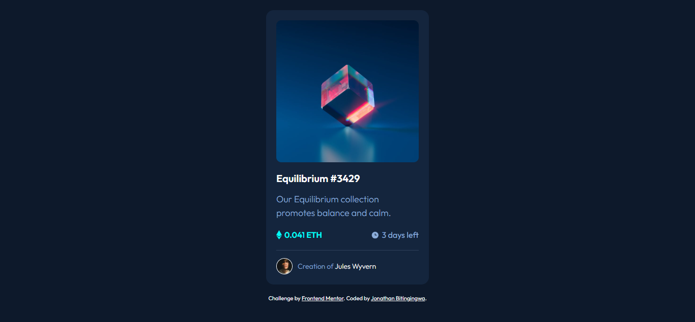

# Frontend Mentor - NFT preview card component solution

## Overview

This is a solution to the [NFT preview card component challenge on Frontend Mentor](https://www.frontendmentor.io/challenges/nft-preview-card-component-SbdUL_w0U). Frontend Mentor challenges help you improve your coding skills by building realistic projects. 

## Table of contents

- [Overview](#overview)
  - [Screenshot](#screenshot)
  - [Links](#links)
- [My process](#my-process)
  - [Built with](#built-with)
  - [What I learned](#what-i-learned)
  - [Challenges](#challenges)
  - [Acknowledgments](#acknowledgments)
  - [Author](#author)

## Screenshot

## Links
- Solution URL: 
- Live Site URL: 

## Built With
- HTML5
- CSS3
- Flexbox
- Hover effects

## What I Learned
- Creating hover overlays
- Using positioning with relative/absolute
- Improving UI details

## Challenges
- Overlay effect positioning
- Hover interactions

## 🙏 Acknowledgments

Thanks to Mentor Samuel and the FreeDev Community for their support.

## Author
- GitHub: https://github.com/Bitingingwa